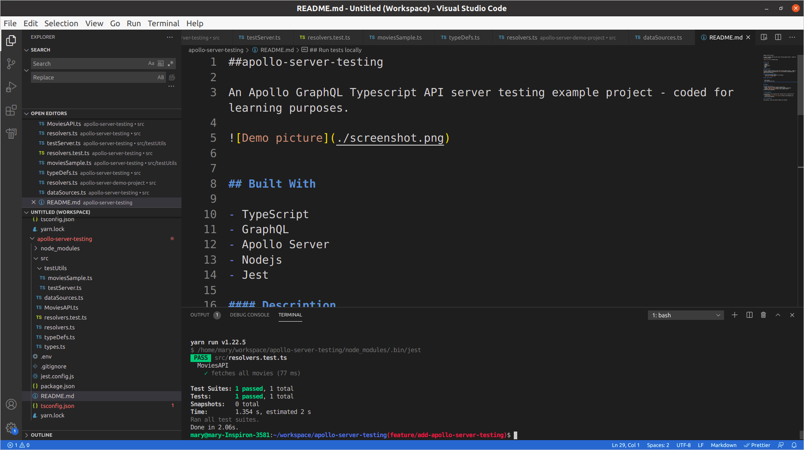

##apollo-server-testing

An Apollo GraphQL Typescript API server testing example project - coded for learning purposes.




## Built With

- TypeScript
- GraphQL
- Apollo Server
- Nodejs
- Jest

#### Description

An Apollo GraphQL TypeScript server API testing example project - coded for learning purposes by following this [tutorial](https://learnitmyway.com/apollo-server-testing/).

## Install typescript globally
  - Type the following command in the terminal
  `npm install -g typescript`
  
## Run tests locally

  ```
  yarn install
  yarn build && yarn test
  
  ```

## Authors

👤 **Marylene Sawyer**
- Github: [@Bluette1](https://github.com/Bluette1)
- Twitter: [@MaryleneSawyer](https://twitter.com/MaryleneSawyer)
- Linkedin: [Marylene Sawyer](https://www.linkedin.com/in/marylene-sawyer-b4ba1295/)


# Acknowledgements

- The content in this repository was retrieved from or inspired by the following sites
  - [Testing Apollo Server with Typescript](https://learnitmyway.com/apollo-server-testing/)

## 🤝 Contributing

Contributions, issues and feature requests are welcome!
